# Protocol Atlas — OpenCode Agent Harness

> **Version:** v4.55.1
> **Last Updated:** 2026-07-10
> **Status:** Active
> **protected-repo:** EXCLUDED — do not touch

---

## One-Page Executive Overview

The OpenCode agent harness takes an engineering task, classifies its risk, routes it to the right model/agent, runs a bounded implementation loop, tests and reviews the result, gates release through CI and reviewer evidence, scores the outcome, extracts lessons, updates model ROI, and improves future routing.

**The full operating loop:**

```
User Task → Risk Classifier → Model/Agent Routing → Plan → Implement → Test → Review → Repair Loop → Release Gate → PR Comment → Score → Lesson Extraction → Model ROI Update → Future Routing Improvement
```

**Key safety properties:**
- protected-repo is always excluded
- Routing is advisory only — never auto-applied
- HIGH-RISK tasks require reviewer evidence and owner approval
- No production mutation without explicit `--apply` approval
- All changes gated by pre-commit hooks and conformance tests

**Current scale:** 815 targeted tests, 0 failures across 16 suites.

---

## Full Operating Loop

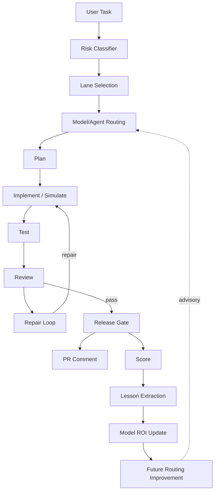

**Diagram file:** `diagrams/system-overview.mmd`

### Loop stages

| Stage | What happens | Owner/Agent | Key artifact |
|-------|-------------|-------------|--------------|
| Intake | Task classified by risk score | Agent | Risk score, lane |
| Routing | Model/agent selected based on advisory recommendations | Agent (advisory) | Routing recommendation |
| Plan | Touch list, success criteria, rollback path | Agent + Owner approval | PLAN.md (STANDARD+) |
| Implement | Bounded code changes within touch list | Agent | Diff |
| Test | Lint, typecheck, unit tests, build | Agent | Gate results |
| Review | Reviewer evidence checked (HIGH-RISK required) | Agent + Reviewer | Reviewer findings |
| Repair | If tests/review fail, cycle back (max_cycles) | Agent | Repair cycle count |
| Release Gate | CI gates, sensitive change classifier, reviewer evidence | CI + Agent | Gate pass/block |
| PR Comment | Sticky PR comment with gate result | CI | PR comment |
| Score | 7 dimensions + 2 penalties, max 35, pass 24 | Agent | Score JSON/MD |
| Lesson Extraction | Failure pattern, fix pattern, recommended action | Agent | loop-lessons.jsonl |
| Model ROI Update | Normalize, analyze, generate recommendations | Agent | ROI scorecard |
| Future Routing | Advisory recommendations feed back to routing | Agent (advisory) | model-routing-policy.recommended.yaml |

---

## Agent Topology / Sub-Agent Responsibilities

The protocol uses a multi-agent architecture where the Orchestrator delegates to specialized sub-agents. All routing is advisory — the Orchestrator makes final decisions.

### Topology Diagram

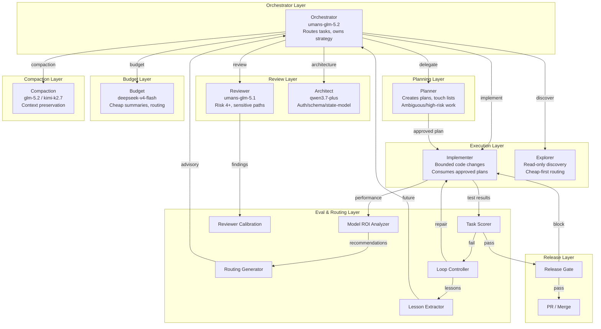

**Diagram file:** `diagrams/agent-topology.mmd` | **Rendered:** `rendered/agent-topology.svg`

### Agent Roles

| Agent | Model | Role | When Used |
|-------|-------|------|-----------|
| **Orchestrator** | umans-glm-5.2 | Routes tasks, owns strategy, makes final decisions | Every session |
| **Planner** | umans-coder | Creates plans, touch lists, success criteria | Ambiguous, multi-step, high-risk work |
| **Implementer** | umans-coder | Bounded code changes within approved touch list | After plan approval |
| **Explorer** | umans-flash | Read-only codebase discovery, dependency mapping | Before planning, cheap-first routing |
| **Reviewer** | umans-glm-5.1 | Risk 4+, sensitive paths, release gates | HIGH-RISK, 4+ files, auth/security/payment |
| **Architect** | qwen3.7-plus | Auth/session semantics, schema, state-model | Architecture decisions, cross-surface design |
| **Budget** | deepseek-v4-flash | Cheap summaries, routing classification, cost summaries | Routine read-only work |
| **Compaction** | glm-5.2 / kimi-k2.7 | Context preservation during long sessions | Session compaction |

### How Agents Cooperate

1. **Orchestrator** receives the user task and classifies risk
2. **Explorer** may be called first for read-only discovery (cheap-first routing)
3. **Planner** creates the implementation plan for ambiguous/high-risk work
4. **Implementer** executes bounded code changes within the approved touch list
5. **Reviewer** checks the output for HIGH-RISK tasks or sensitive paths
6. **Architect** is consulted for auth/schema/state-model decisions
7. **Budget** handles cheap summaries and routing classification
8. **Compaction** preserves context during long sessions
9. **Loop Controller** manages repair cycles if tests fail
10. **Task Scorer** scores the outcome (7 dimensions, max 35, pass 24)
11. **Lesson Extractor** captures failure patterns for future use
12. **Model ROI Analyzer** normalizes performance data
13. **Routing Generator** produces advisory recommendations
14. **Release Gate** validates CI, sensitive changes, and reviewer evidence
15. **PR/Merge** requires human approval — no auto-merge

### Advisory-Only Principle

All routing and reviewer policies are advisory (`auto_applied: false`). The Orchestrator uses recommendations as guidance but makes final decisions. No policy is automatically applied without owner review.

---

## Task Lifecycle

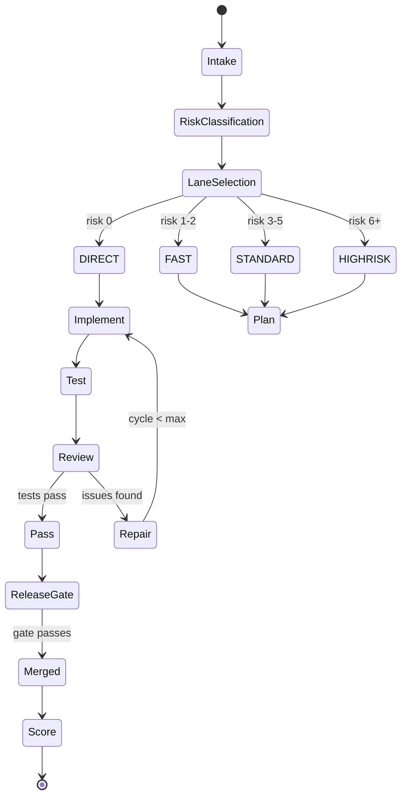

**Diagram file:** `diagrams/task-lifecycle.mmd`

---

## Risk Routing Decision Tree

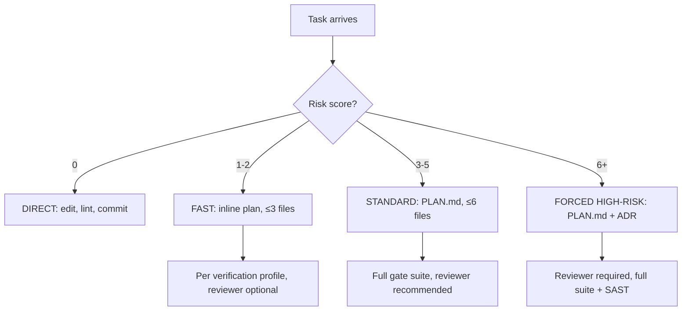

**Diagram file:** `diagrams/risk-routing-decision-tree.mmd`

### Lane summary

| Lane | Risk | Files | Plan | Gates | Reviewer | Checkpoint |
|------|------|-------|------|-------|----------|------------|
| DIRECT | 0 | 1 | None | Lint only | No | Lite |
| FAST | 1-2 | ≤3 | Inline bullets | Per profile | Optional | Lite |
| STANDARD | 3-5 | ≤6 | PLAN.md | Full suite | Recommended | Full |
| HIGH-RISK | 6+ | ≤10 | PLAN.md + ADR | Full + SAST | Required | Full |

Forced HIGH-RISK: auth, payment, schema, migration, cryptography, destructive action, user data, state model rewrite.

---

## Safety and Release Gate Flow

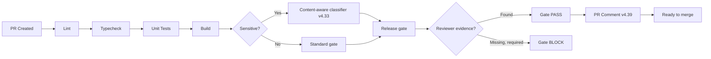

**Diagram file:** `diagrams/release-gate-flow.mmd`

### Release gate components

| Component | Version | Purpose |
|-----------|---------|---------|
| `validate-release-gate.sh` | v4.34 | Main gate validator |
| `sensitive-change-classifier.sh` | v4.33 | Content-aware sensitive change detection |
| `release-decision-report.sh` | v4.34 | Gate decision report |
| `reviewer-evidence-detector.sh` | v4.35 | Detects reviewer evidence in PR |
| `post-release-gate-comment.sh` | v4.39 | Sticky PR comment with gate result |
| `install-release-gate.sh` | v4.37 | Multi-repo installer |
| `reviewer-trust-policy.yaml` | v4.36 | Trust policy for reviewer evidence |

---

## Reviewer Evidence Flow

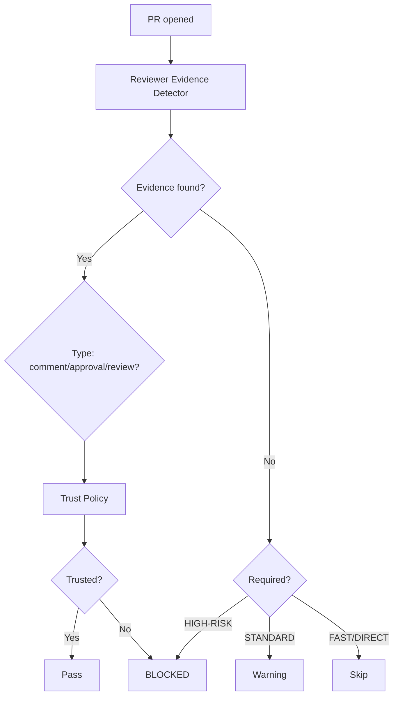

**Diagram file:** `diagrams/reviewer-evidence-flow.mmd`

---

## Eval / Replay / Loop Flow

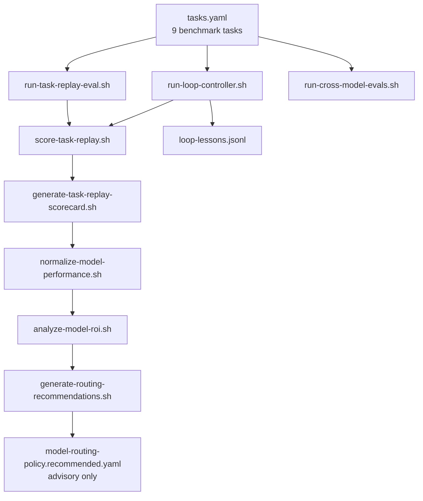

**Diagram file:** `diagrams/eval-loop-flow.mmd`

### Eval components

| Component | File | Purpose |
|-----------|------|---------|
| Task registry | `.opencode/evals/task-replay/tasks.yaml` | 9 historical benchmark tasks |
| Replay runner | `run-task-replay-eval.sh` | --dry-run, --score-only, --record-result |
| Loop controller | `run-loop-controller.sh` | State machine, stop conditions, repair policy |
| Cross-model runner | `run-cross-model-evals.sh` | Multi-model eval runner |
| Scoring engine | `score-task-replay.sh` | 7 dimensions + 2 penalties, max 35 |
| Scorecard | `generate-task-replay-scorecard.sh` | Aggregate results |
| Normalizer | `normalize-model-performance.sh` | Unified JSONL with result_type |
| ROI analyzer | `analyze-model-roi.sh` | By-model, by-task-type, by-risk-lane |
| Routing generator | `generate-routing-recommendations.sh` | Advisory recommendations + YAML policy |
| Lessons | `loop-lessons.jsonl` | Failure patterns, fix patterns |

### Scoring dimensions

| Dimension | Max | Weight | Type |
|-----------|-----|--------|------|
| root_cause_correct | 5 | 5 | Scored |
| minimal_diff | 5 | 4 | Scored |
| test_quality | 5 | 4 | Scored |
| ci_success | 5 | 4 | Scored |
| security_risk_handling | 5 | 5 | Scored |
| evidence_quality | 5 | 3 | Scored |
| lesson_reuse | 5 | 3 | Scored |
| reviewer_issue_count | — | -2/issue | Penalty (max -10) |
| repair_cycles | — | -3/cycle | Penalty (max -9) |
| time_cost | — | tracked | Not penalized |

**Max score: 35 | Pass threshold: 24 (70%)**

---

## Model ROI / Routing Flow

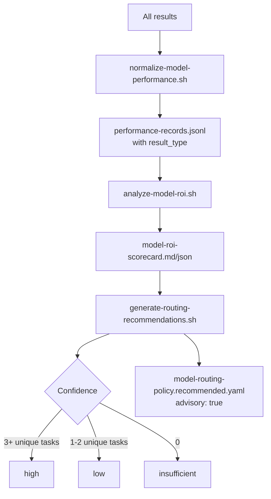

**Diagram file:** `diagrams/model-roi-routing-flow.mmd`

### Confidence calibration

| Level | Requirement | Behavior |
|-------|-------------|----------|
| high | 3+ unique tasks | Full recommendation with rationale |
| low | 1-2 unique tasks | Recommendation marked "low confidence" |
| insufficient | 0 unique tasks | No recommendation, missing data flagged |

### Routing guardrails

- protected-repo excluded from all routing
- No self-attested score-only promotion without evidence
- No production route change without explicit owner approval
- No HIGH-RISK downgrade to low-cost model purely for cost
- Stale eval data (>30 days) triggers warning
- Recommended YAML policy is advisory only (`auto_applied: false`)

---

## Fleet Protection Flow

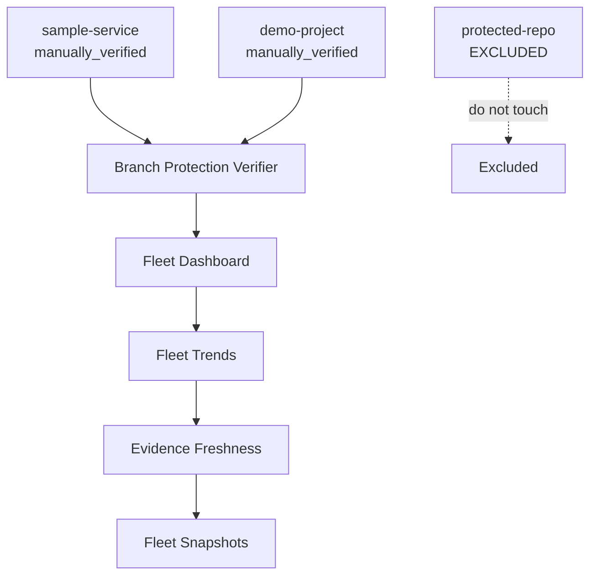

**Diagram file:** `diagrams/fleet-protection-flow.mmd`

### Fleet status

| Repo | Status | Freshness |
|------|--------|-----------|
| sample-service | manually_verified | Fresh |
| demo-project | manually_verified | Fresh |
| protected-repo | EXCLUDED | Do not touch |

---

## Human Owner Responsibility Map

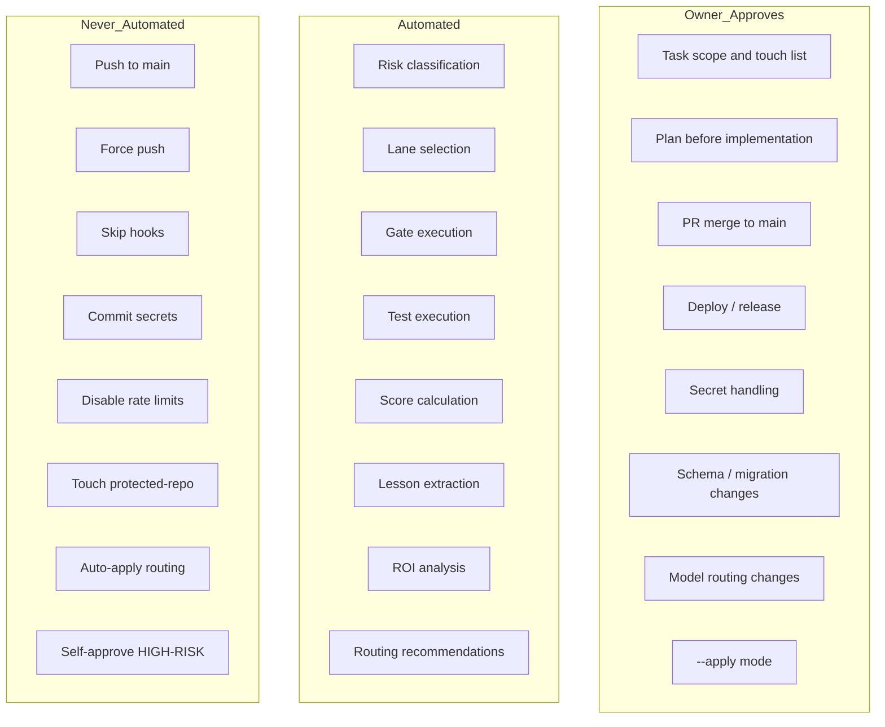

**Diagram file:** `diagrams/operator-responsibility-map.mmd`

---

## Artifact / Source-of-Truth Map

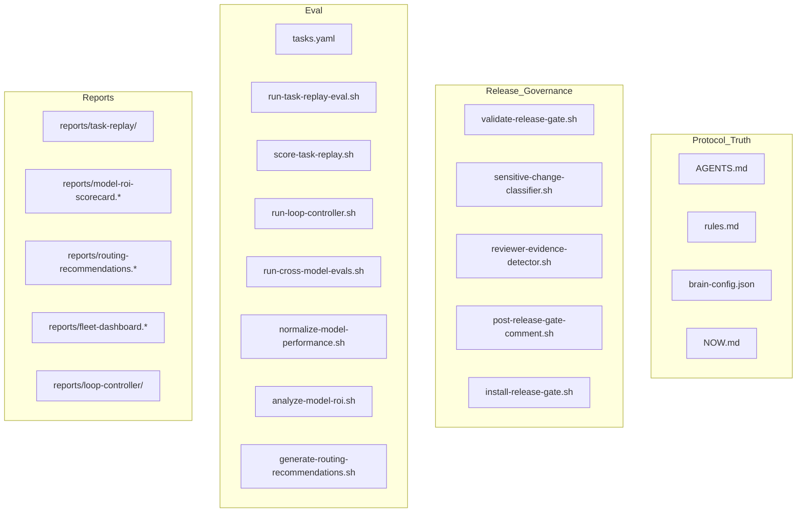

**Diagram file:** `diagrams/artifact-map.mmd`

### Key artifacts

| Artifact | Location | Authority |
|----------|----------|-----------|
| AGENTS.md | workspace root | Workspace router |
| rules.md | `.opencode/rules.md` | OpenCode guardrails |
| brain-config.json | `.opencode/brain-config.json` | Orchestration policy |
| NOW.md | repo root | Current state |
| PLAN.md | repo root | Active plan |
| tasks.yaml | `.opencode/evals/task-replay/` | Benchmark tasks |
| performance-records.jsonl | `.opencode/metrics/model-performance/` | Normalized records |
| loop-lessons.jsonl | `.opencode/evals/lessons/` | Extracted lessons |
| model-routing-policy.recommended.yaml | `.opencode/config/` | Advisory routing policy |

---

## Glossary

| Term | Definition |
|------|------------|
| Lane | Risk classification: DIRECT, FAST, STANDARD, HIGH-RISK |
| Touch list | Approved list of files that may be modified |
| Gate | Quality check: lint, typecheck, test, build |
| Release gate | CI gate that validates PR before merge |
| Reviewer evidence | Proof that a reviewer examined the change |
| Trust policy | Rules for what reviewer evidence is trusted |
| Task replay | Replaying a historical task to evaluate agent performance |
| Loop controller | Bounded execution loop with stop conditions |
| Result type | replay_result, loop_result, or live_task_result |
| Confidence | high (3+ unique tasks), low (1-2), insufficient (0) |
| best_observed | Best model from available evidence (not globally proven) |
| best_overall | Best model from cross-model comparison (2+ models) |
| protected-repo | Excluded repo — never touched by any component |
| Advisory only | Routing recommendations are not auto-applied |
| Freshness | How recently evidence was verified (expires after 90 days) |

---

## How to Use This Atlas

### 5-Minute Explanation (for anyone)

1. **"The harness takes a task, classifies its risk, and routes it to the right model."**
   - Risk classifier → lane selection → advisory routing

2. **"It runs a bounded loop: plan, implement, test, review, repair."**
   - Max cycles, stop conditions, forbidden files, protected-repo excluded

3. **"Every change goes through a release gate with CI and reviewer evidence."**
   - Sensitive change classifier, reviewer evidence detector, trust policy

4. **"After completion, it scores the outcome and extracts lessons."**
   - 7 scoring dimensions, lesson extraction to JSONL

5. **"Scores feed into model ROI, which generates advisory routing recommendations."**
   - Confidence based on unique tasks, best_observed not best_overall, advisory only

### 15-Minute Deep Dive (for engineers)

1. **Start with the system overview diagram** (`diagrams/system-overview.mmd`) — shows the full operating loop
2. **Walk through the task lifecycle** (`diagrams/task-lifecycle.mmd`) — explains state machine and lane selection
3. **Review the release gate flow** (`diagrams/release-gate-flow.mmd`) — shows how CI gates and reviewer evidence work
4. **Examine the eval/loop flow** (`diagrams/eval-loop-flow.mmd`) — shows how tasks are replayed and scored
5. **Study the model ROI flow** (`diagrams/model-roi-routing-flow.mmd`) — shows how routing recommendations are generated
6. **Check the operator responsibility map** (`diagrams/operator-responsibility-map.mmd`) — shows what's automated vs owner-approved

### For Non-Technical Stakeholders

- **What it does**: Safely automates engineering tasks with quality gates
- **Why it's safe**: protected-repo excluded, routing advisory only, HIGH-RISK requires human approval
- **What it measures**: 7 quality dimensions per task, model ROI by task type
- **What it learns**: Lessons extracted to JSONL, routing improves over time
- **What it doesn't do**: No auto-push to main, no self-approval, no secret exposure

### Rendered Diagrams

SVG renders of all diagrams are available in `docs/protocol/rendered/`. To regenerate:

```bash
npx @mermaid-js/mermaid-cli -i docs/protocol/diagrams/<diagram>.mmd -o docs/protocol/rendered/<diagram>.svg -b transparent
```

Any new diagram must pass render validation via `validate-protocol-atlas.sh`.

---

## Maintenance Rules

### When must this atlas be updated?

Update this atlas when changes affect:

- **Routing** — model routing policy, confidence calibration, guardrails
- **Risk lanes** — lane definitions, thresholds, forced HIGH-RISK triggers
- **Reviewer behavior** — trust policy, evidence types, reviewer requirements
- **Release gates** — gate components, sensitive change classifier, PR comments
- **Eval scoring** — scoring dimensions, penalties, pass threshold
- **Loop controller** — state machine, stop conditions, repair policy
- **Model ROI** — normalizer, analyzer, recommendation generator
- **Fleet dashboard** — fleet repos, protection status, freshness
- **Manual evidence** — evidence types, freshness expiry, manual verification
- **Owner workflow** — approval boundaries, never-automated rules

### How to update

1. Update the relevant section in `PROTOCOL_ATLAS.md`
2. Update the corresponding Mermaid diagram in `diagrams/`
3. Run `bash .opencode/scripts/validate-protocol-atlas.sh`
4. Run `bash .opencode/conformance/tests/protocol-atlas.sh`
5. Commit with conventional message

---

*Generated as part of v4.48.1 — Protocol Atlas / Visual System Map. Updated v4.50 — Core v1 Hardening Release.*
